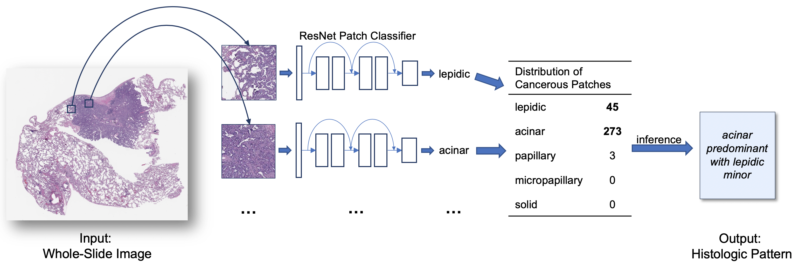

# DeepSlide: A Sliding Window Framework for Classification of High Resolution Microscopy Images (Whole-Slide Images)

By [Jason Wei](https://jasonwei20.github.io), Behnaz Abdollahi, and [Saeed Hassanpour](https://hassanpourlab.com)

This repository is a sliding window framework for classification of high resolution whole-slide images, often microscopy or histopathology images.



## Dependencies
- [Python 3.6](https://www.anaconda.com/download/#macos)
- [PyTorch](https://pytorch.org/)
- [PIL](https://pillow.readthedocs.io/en/5.3.x/)
- [OpenCV](https://opencv.org/)
- [Scikit-Learn](https://scikit-learn.org/stable/install.html)
- [Scipy](https://www.scipy.org/)
- GPU

# Usage

Take a look at `code/config.py` before you begin to get a feel for what parameters can be changed.

## 1. Train-Val-Test Split:

Splits the data into a validation and test set. Default validation whole-slide images (WSI) per class is 15 and test images per class is 30. You can change these numbers by changing `val_wsi_per_class` and `test_wsi_per_class` in `code/config.py`. You can skip this step if you did a custom split (for example, you need to split by patients).

```
python code/1_split.py
```

If you do not want to duplicate the data, set `keep_orig_copy` in `code/config.py` to `False`.

**Inputs**: `all_wsi`

**Outputs**: `wsi_train`, `wsi_val`, `wsi_test`, `labels_train.csv`, `labels_val.csv`, `labels_test.csv`


## 2. Data Processing

- Generate patches for the training set.
- Balance the class distribution for the training set.
- Generate patches for the validation set.
- Generate patches by folder for WSI in the validation set.
- Generate patches by folder for WSI in the testing set.

```
python code/2_process_patches.py
```

Note that this will take up a significant amount of space. Edit `num_train_per_class` in `config.py` to be smaller if you wish to not generate as many windows. If your histopathology images are H&E-stained, whitespace will automatically be filtered. Turn this off in `type_histopath` in `code/config.py`. Default overlapping area is 1/3 for test slides. Use 1 or 2 if your images are very large; you can also change this in `slide_overlap` in `code/config.py`.

**Inputs**: `wsi_train`, `wsi_val`, `wsi_test`

**Outputs**: `train_folder` (fed into model for training), `patches_eval_train` (for validation, sorted by WSI), `patches_eval_test` (for testing, sorted by WSI)


## 3. Model Training

```
CUDA_VISIBLE_DEVICES=0 python code/3_train.py
```

We recommend using ResNet-18 if you are training on a relatively small histopathology dataset. You can change hyperparameters in `code/config.py`. There is an option to retrain from a previous checkpoint. Model checkpoints are saved by default every epoch in `checkpoints`.

**Inputs**: `train_folder`

**Outputs**: `checkpoints`, `logs`


## 4. Testing on WSI

Run the model on all the patches for each WSI in the validation and test set.

```
CUDA_VISIBLE_DEVICES=0 python code/4_test.py
```

We automatically choose the model with the best validation accuracy. You can also specify your own. You can change the thresholds used in the grid search by editing `threshold_search` in `code/config.py`.

**Inputs**: `patches_eval_val`, `patches_eval_test`

**Outputs**: `preds_val`, `preds_test`


## 5. Searching for Best Thresholds

The simplest way to make a whole-slide inference is to choose the class with the most patch predictions. We can also implement thresholding on the patch level to throw out noise. To find the best thresholds, we perform a grid search. This function will generate csv files for each WSI with the predictions for each patch.

```
python code/5_grid_search.py
```

**Inputs**: `preds_val`, `labels_val.csv`

**Outputs**: `inference_val`


## 6. Visualization

A good way to see what the network is looking at is to visualize the predictions for each class.

```
python code/6_visualize.py
```

**Inputs**: `wsi_val`, `preds_val`

**Outputs**: `vis_val`

You can change the colors in `colors` in `code/config.py`


## 7. Final Testing

Do the final testing to get the confusion matrix on the test set.

```
python code/7_final_test.py
```

**Inputs**: `preds_test`, `labels_test.csv`, `inference_val` and `labels_val` (for the best thresholds)

**Outputs**: `inference_test` and confusion matrix to stdout

Best of luck.

# Quick Run

If you have utter trust in this code and do not want to see the outputs at each step, do:
```
sh code/run_all.sh
```


# Pre-Processing Scripts

See `code/z_preprocessing` for some code to convert images from svs into jpg. This uses OpenSlide and takes a while. How much you want to compress images will depend on the resolution that they were originally scanned, but a guideline that has worked for us is 3-5 MB per WSI.


# Still not working? Consider the following...

- Ask a pathologist to look at your visualizations.
- Make your own heuristic for aggregating patch predictions to get WSI classification. Often, a slide thats 20% abnormal and 80% normal should be classified as abnormal.
- If each WSI can have multiple types of lesions/labels, you may need to annotate bounding boxes around these.
- Did you pre-process your images? If you used raw .svs files that are more than 1GB in size, its likely that the patches are way too zoomed in to see any cell structures.
- If you have less than 10 WSI per class in the training set, get more.
- Normalizing color channels with custom values. You can change this in `utils_model.py`.
- Feel free to view our end-to-end attention-based model: [https://arxiv.org/abs/1811.08513](https://arxiv.org/abs/1811.08513).

# Future Work

- Contributions to this repository are welcome. 
- Code for generating patches on the fly instead of storing them in memory for training and testing would save a lot of disk space.
- If you have issues, please post in the issues section and we will do our best to help.

# Citations

DeepSlide is an open-source library and is licensed under the [GNU General Public License (v3)](https://www.gnu.org/licenses/gpl-3.0.en.html). This method was orginally used in [Deep learning for classification of colorectal polyps on whole-slide images](http://www.jpathinformatics.org/article.asp?issn=2153-3539;year=2017;volume=8;issue=1;spage=30;epage=30;aulast=Korbar), published in the Journal of Pathology Informatics in 2017 and recognized as the winner of the Journal of Pathology Informatics Most Popular Article Award of that year. For questions contact Saeed Hassanpour at [Saeed.Hassanpour@dartmouth.edu]( ). If you are using this library please cite:


Bruno Korbar, Andrea M. Olofson, Allen P. Miraflor, Catherine M. Nicka, Matthew A. Suriawinata, Lorenzo Torresani, Arief A. Suriawinata, Saeed Hassanpour, “Deep Learning for Classification of Colorectal Polyps on Whole-Slide Images”, Journal of Pathology Informatics, 8:30, 2017.

